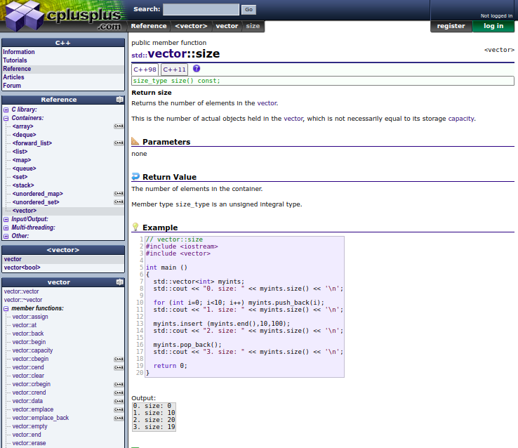

## Protótipo de papel

## Planejamento

### Introdução

Apesar de possuir um fórum para tirar dúvidas e interagir com a comunidade, artigos que aprofundam determinados aspectos sobre  o c++ e tutoriais que apresentam informações basicas sobre a linguagem, auxiliando novos programadores. Foi observado que os usuários buscavam a aplicação principalmente pelas "referências", que é uma seção da aplicação para tirar dúvidas sobre bibliotecas e suas funções e containers. 

### Objetivos

Nosso protótipo tem como objetivos: 

- Fazer	julgamento de valor sobre a	qualidade de uso da	solução de IHC
- Identificar problemas na interação e na interface que prejudiquem a experiência particular do usuário durante o uso do sistema
- Propor 4 novas funcionalidades na aplicação para auxiliar o usuário, que foram identificadas como restrições [Características da Plataforma
](https://interacao-humano-computador.github.io/2019.2-CPlusPlus/#/docs/platform_features/platform_features), são elas:
    - Executar código
    - Editar código
    - Copiar código
    - Trocar o tema

### Objetivos de avaliação

- Analisar a apropriação da tecnologia
    1) Quais são os pontos fortes e fracos do sistema, na opinião dos usuários?
    2) A tecnologia disponivel pode oferecer mais interessantes ou eficientes dos usuários atingirem seus objetivos?
- Verificar a conformidade com um padrão
    1) A interface segue o padrão do sistema operacional e da empresa?
- Identificar problemas na interação e interface
    1) Ele entende o que significa e para que serve cada elemento de inteface?

**Perfil dos usuários**: Estudantes universitários

**Como é atualmente:**

### Protótipo

<!DOCTYPE html>
<html>
<body>

<iframe width="750" height="400" src="https://www.youtube.com/embed/EJrHm5A48g0" frameborder="0" allow="accelerometer; autoplay; encrypted-media; gyroscope; picture-in-picture" allowfullscreen></iframe>

</body>
</html>

## Resultados

- Analisar a apropriação da tecnologia
    1) O processo foi intuitivo com elementos significativos para a atividade proposta. 
    2) Uma alternativa oferecida pela plataforma não é bem aceita pelos usuários, pois, abre uma nova guia possuindo um estilo totalmente diferente do site.
- Verificar a conformidade com um padrão
    1) Sim
- Identificar problemas na interação e interface
    1) Dois icônes da interface geraram dúvidas nos usuários

**Problemas encontrados:** 
- O botão "+" gerou outras interpretações em relação ao objetivo da funcionalidade.
- Confusão entre dois elementos da interface, mas a legenda auxiliou os usuários.

**Reprojeto do sistema:**
- Será retirado o botão "+" e mantido as opções já expostas pro usuário.
- Será trocado um dos icones usados, além de manter a legenda de cada funcionalidade quando o usuário passa o mouse por cima da mesma