# Perfil do Usuário

| Data       | Versão | Descrição            | Autor             |
|:----------:|:------:|:--------------------:|:-----------------:|
| 10/10/2019 | 1.0 | Criação do documento do Perfil do Usuário  | Lucas Fellipe e Gabriel Davi |

 &emsp;&emsp; O objetivo principal desse módulo foi traçar um perfil de usuário que revelasse de maneira clara as principais características dos usuários do sistema. Para tal, o principal método utilizado foi o <i>questionário</i> devido ao seu alto alcançe e a capacidade de detalhamento gráfico dos resultados. O questionário pode ser acessado <a href="https://docs.google.com/forms/d/e/1FAIpQLSc-6D6zLzButeCeghifVh1Yln_aa8W5R2Xn_rUlESGwvXnO7A/viewform"> aqui.</a>

## Questionário

  questionário foi dividido em duas sessões, uma sobre perfil demográfico e outra a cerca do perfil técnico do usuário.

### 1 - Perfil demográfico
A sessão acerca do perfil demográfico dos usuário envolviam os seguintes tópicos:
* Gênero
* Idade
* Escolaridade
* Ocupação
* Região onde mora
* Idiomas

#### resultados

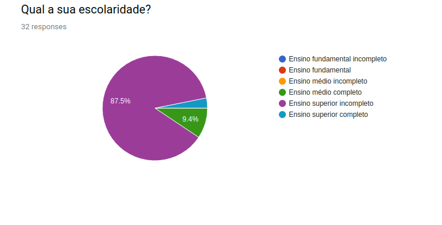

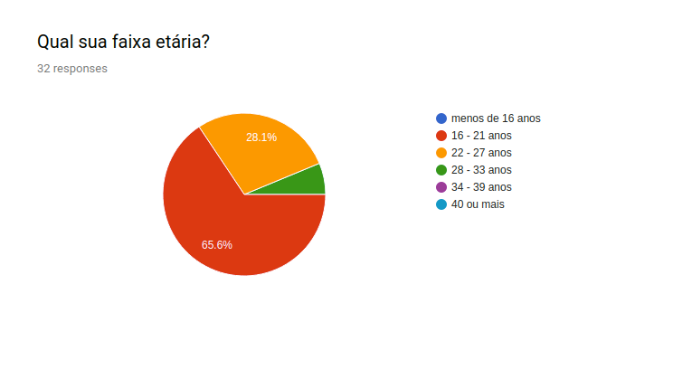

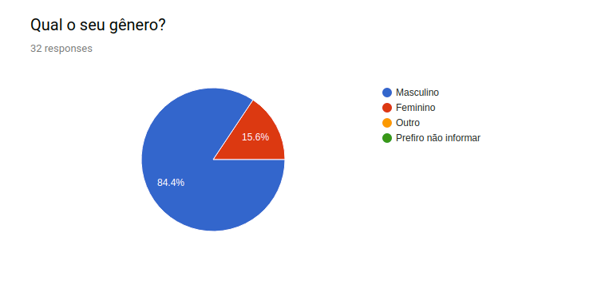

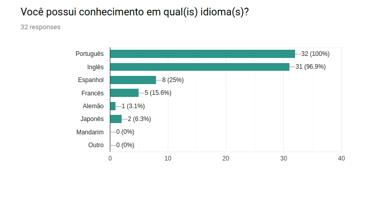

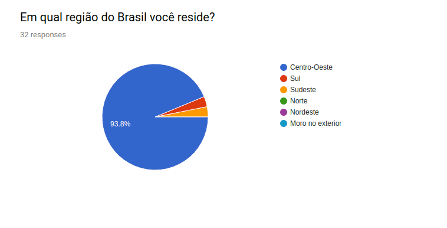

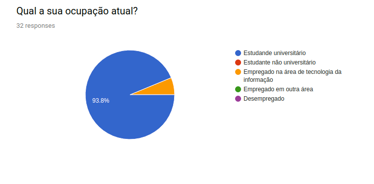

No geral, as informações demográficas demonstram:
* Maioria masculina;
* Média de idade próxima a 20 anos;
* Maioria estudantes universitários;
* Região principal Centro-Oeste;
* Os usuários, em geral, falam o português e o inglês.

## 2- Perfil técnico

A sessão acerca do perfil técnico dos usuários envolviam os seguintes tópicos:
* Afinidade com computadores;
* Afinidade com as linguagens de programação C e C++;
* Satisfação com a plataforma CPlusPlus.

#### resultados

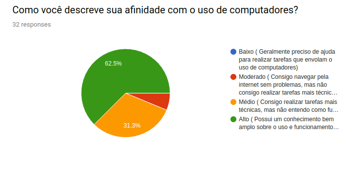

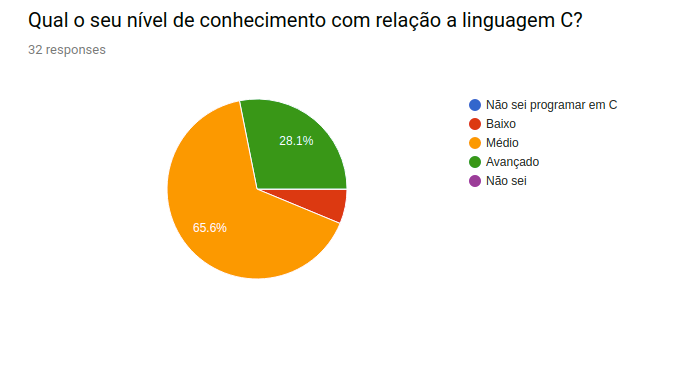

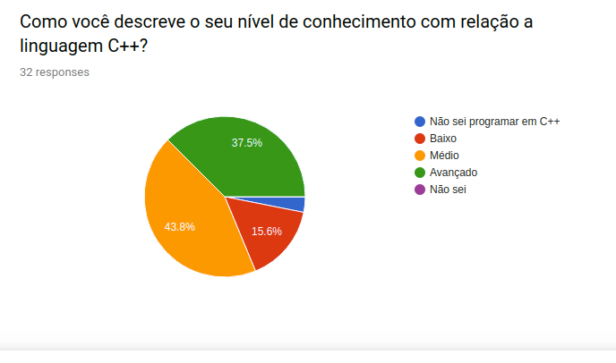

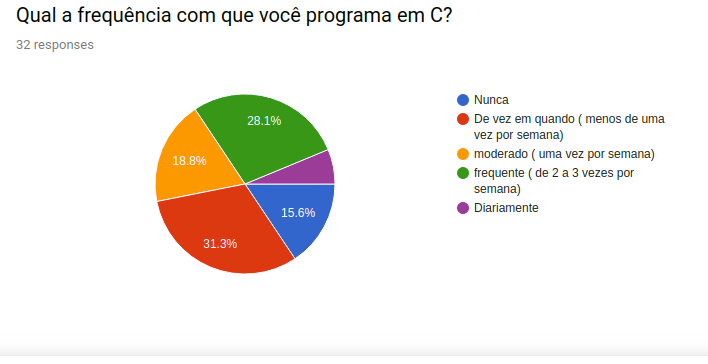

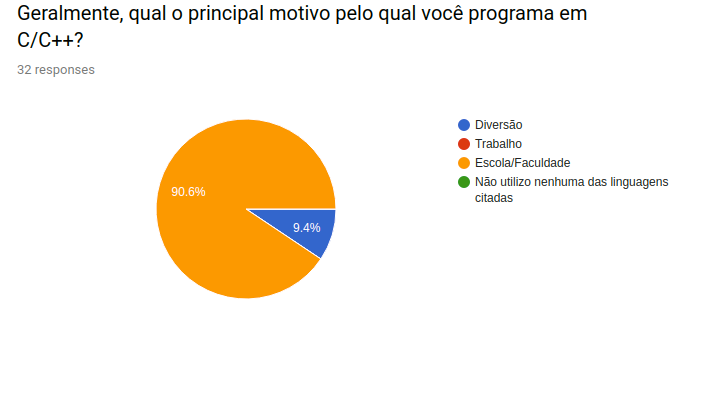

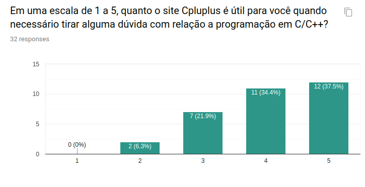

No geral, as informações demonstram:
* Usuários possuem grande afinidade com computadores
* Possuem um conhecimento médio em C++/C
* Maioria dos usuários utilizam  a  linguagem por conta  da faculdade
* A ferramenta se mostra bastante útil no suporte aos usuários.

## Conclusão

Observa-se que a maioria dos usuários que utilizam a plataforma são estudantes, que possuem o inglês como o segundo idioma. O que já é esperado uma vez que o site tem a língua inglesa como padrão.
O nível de conhecimento nas linguagens C/C++, em geral, é médio. O que também é esperado uma vez que o intuito da plataforma é auxiliar nas dúvidas nessas tecnologias. Todavia, há um número considerável usuários que apresentam um conhecimento avançado na linguagem, o que mostra que as informações presentes no site contemplam programadores de todos os níveis 

<!DOCTYPE html>
<html>
<head>

<link rel="stylesheet" href="docs/assets/css/table.css">
</head>